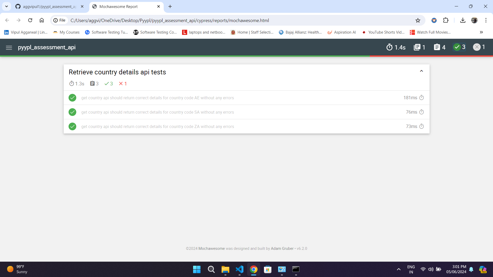
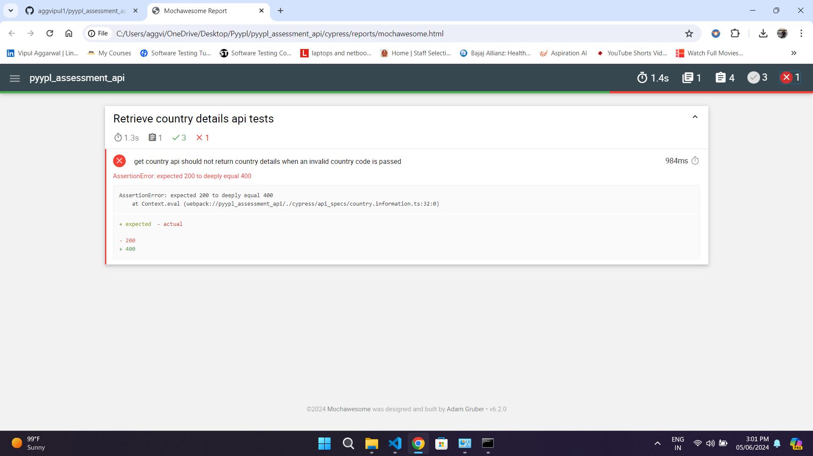

## API Assignment test using Cypress

<!-- ABOUT THE PROJECT -->
## About The Project
This repository contains API automation assigment using Cypress and TypeScript with mochawesome reporter. Below
* `api_specs` directory: includes the specs/tests
* `fixtures` directory: includes the test data like queries & expected responses.
* `utils` directory: includes all the resuable files like config & graphql_util.
* `reports` directory: includes the mochawesome json & html report generated after test execution.
* `result_examples` directory: includes the report execution images used in readme.


<!-- GETTING STARTED -->
## Getting Started
### Prerequisites
* Make sure you have `node.js` installed. If you don't, go to [official website](https://nodejs.org/en/download/) for instructions.
* To install cypress follow the instructions mentioned [here](https://docs.cypress.io/guides/getting-started/installing-cypress)

### Installation
* Clone the repository
   ```sh
   git clone https://github.com/aggvipul1/pyypl_assessment_api.git
   ```

* Run below command to install node modules
   ```shell
   npm install
   ```

### Execute Specs
Run below command mentioned in `package.json` to run the tests.
   ```shell
   npm run execute:api:test
   ```
    
### Execution Report
* The test reports are saved in `reports` directory
* Samples of test report generated
  * Successful execution resut  
  * Failure execution result  


### Note
These tests successfully execute & work fine on NodeJs version 22.2.0 on windows11